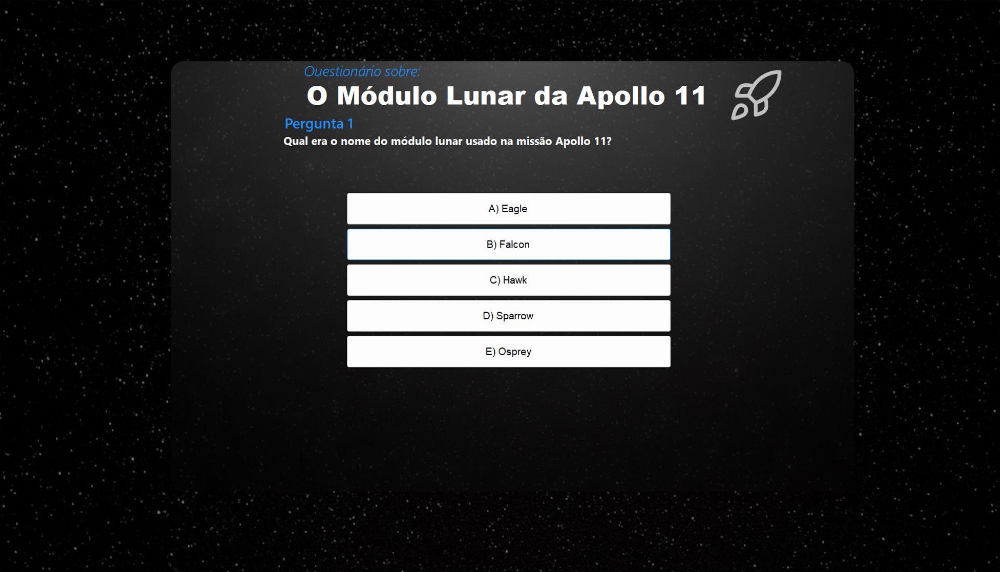
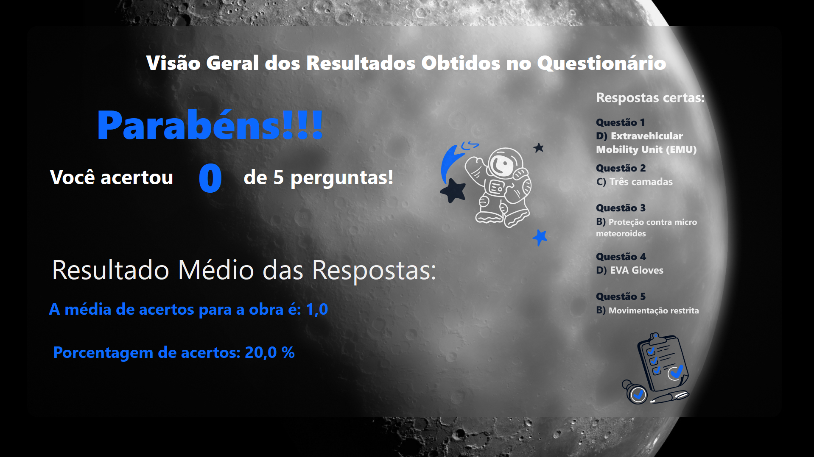

# Museu da Primeira Viagem à Lua 🏛

Este projeto foi apresentado como desafio no terceiro semestre de Análise e Desenvolvimento de Sistemas onde foi proposto o conceito de um museu de temática múltipla centrado na primeira viagem do ser humano à Lua. O objetivo do museu é oferecer uma experiência educativa e interativa aos seus visitantes, permitindo que eles explorem as obras em exposição e obtenham informações históricas por meio de um totem interativo.

Para realizar esse projeto, foi necessário a criação de 4 programas que iriam fazer a interação da experiência com o usuário com o museu. Segue abaixo o repositório dos outros 3 programas:

-[Programa de Avaliação 📊 ](https://github.com/Paulopaiv/PIM-III-ADS-VISITANTE) 

-[Programa de Administração 📋 ](https://github.com/Paulopaiv/PIM-III-ADS-ADM) 

-[Programa de Vendas 🛒 ](https://github.com/Paulopaiv/PIM-III-ADS-VENDAS) 

## Funcionalidades Principais ⚙️

- Exposição de obras relacionadas à primeira viagem à Lua.
- Totem interativo para obtenção de informações históricas.
- Pesquisa sobre a exposição para melhorar a experiência dos visitantes.
- Coleta dinâmica de questionários em conformidade com a LGPD.

## Tecnologias Utilizadas 🛠

- Plataforma: .NET
- Linguagem: C#
- Framework: Windows Forms

## Layout 🎨

O desenvolvimento do sistema segue os princípios de Design de Interface do Usuário e o paradigma de Orientação a Objetos, visando oferecer uma experiência intuitiva e eficiente aos usuários.

  
  
  
  

## ✒️ *Autores*

- [Ayumi Muraki](https://github.com/AyuMuraki)
- [Lucas](https://github.com/LucasCerione)
- [Nicolas Onishi](https://github.com/NicolasKonishi)
- [Paulo Paiva](https://github.com/Paulopaiv)

## Como contribuir 💪

Se você deseja contribuir para este projeto, siga as etapas abaixo:

1. Faça um fork deste repositório.
2. Crie um branch: `git checkout -b <nome_branch>`.
3. Faça suas alterações e confirme-as: `git commit -m '<mensagem_commit>'`
4. Envie para o branch original: `git push origin <nome_do_projeto> / <local>`
5. Criar a solicitação de pull.

Caso tenha alguma dúvida, consulte a documentação do GitHub sobre [como criar uma solicitação de pull](https://help.github.com/en/github/collaborating-with-issues-and-pull-requests/creating-a-pull-request).

## ⏭️ Próximos passos

- Agendamento de visitas: Integrar um sistema de agendamento de visitas ao museu;
- Gamificação: Criar um sistema de gamificação para incentivar a participação dos visitantes na pesquisa;
- Notificações: Implementar um sistema de notificações para eventos e atualizações do museu.
